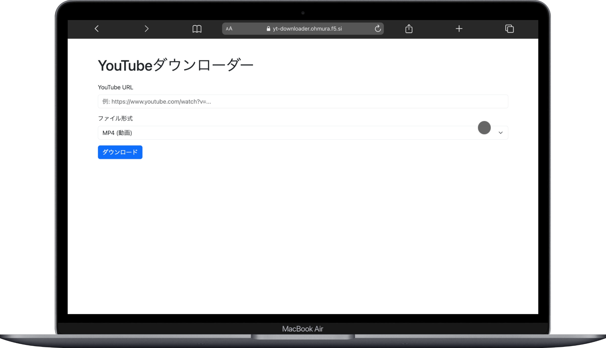

# YouTubeダウンローダー

学校のPHPの授業の課題で作ったもの<br>
yt-dlpにより、mp4, mov, m4a, mp3形式でダウンロードできる

[https://yt-downloader.ohmura.f5.si/](https://yt-downloader.ohmura.f5.si/)



## 使用スタック

[](https://skillicons.dev)

## 苦労したところ

- macやiphoneで再生できるようにコーデックを調整したところ
- キャッシュを使っているから古いキャッシュを取り出さないようにキーを作って対応したところ
- phpのfpmイメージは、CMDなどを使う時は[startup.sh](./startup.sh)のように自分で```. /usr/local/bin/docker-php-entrypoint php-fpm```を付け加えないといけないこと
